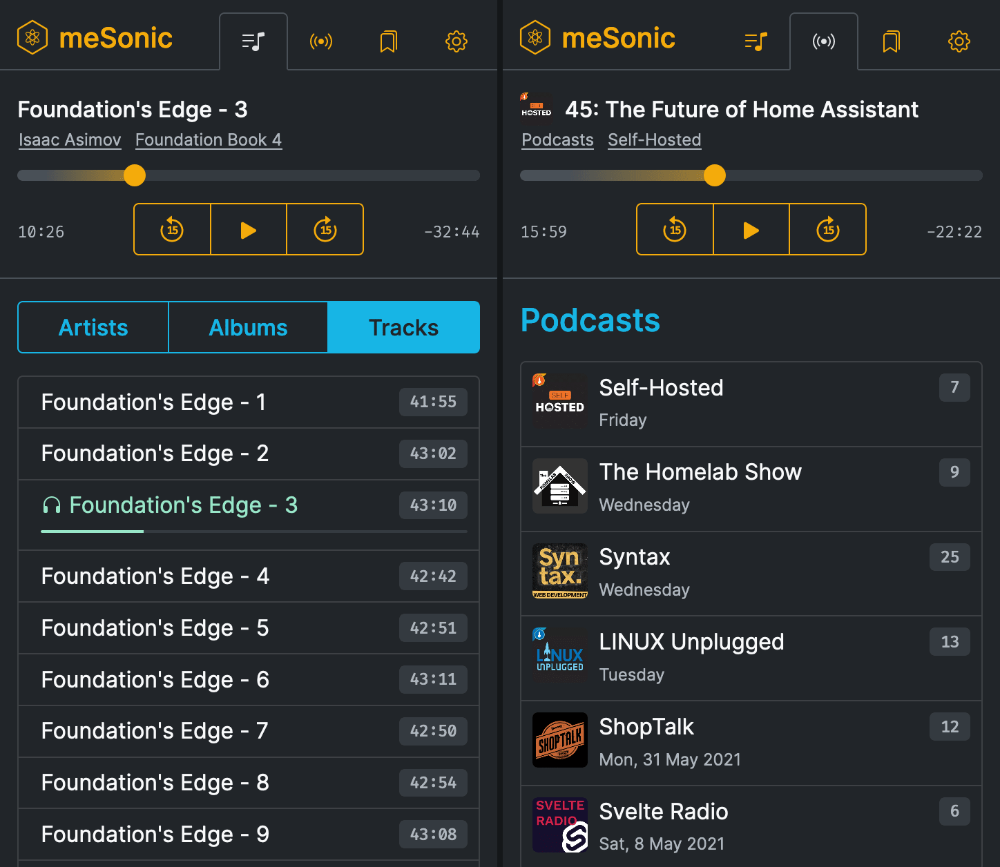

# meSonic

**meSonic** is an experimental **media server** and **web client** partially compatible with the Subsonic API. At present I'm developing this for personal use but I'll provide more documentation in time.

See the blog articles below for more information.

* * *

### Related blog articles

* [Cloudflare Pages and Workers](https://dbushell.com/2021/05/14/cloudflare-dns-pages-workers/)
* [Natural Alphanumeric Sorting in JavaScript](https://dbushell.com/2021/05/17/javascript-natural-alphanumeric-sorting/)
* [Relative Date Formatting in JavaScript](https://dbushell.com/2021/06/08/javascript-relative-date-time-formatting/)

* * *

Copyright © 2023 [David Bushell](https://dbushell.com) | [@dbushell](https://twitter.com/dbushell)
