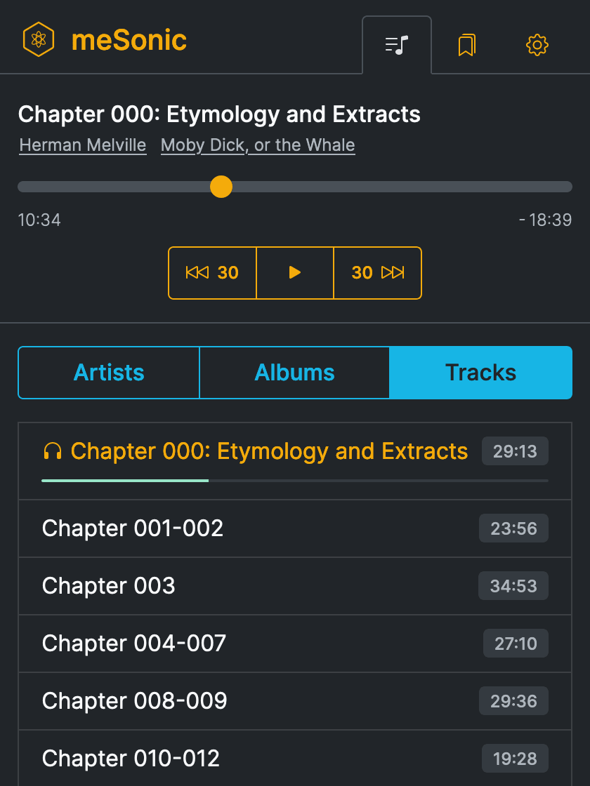

# meSonic

meSonic is an experimental **media server** and **web client** partially compatible with the Subsonic API.

* * *

### Related blog articles

* [Cloudflare Pages and Workers](https://dbushell.com/2021/05/14/cloudflare-dns-pages-workers/)

* * *

Copyright © 2021 [David Bushell](https://dbushell.com) | [@dbushell](https://twitter.com/dbushell)
